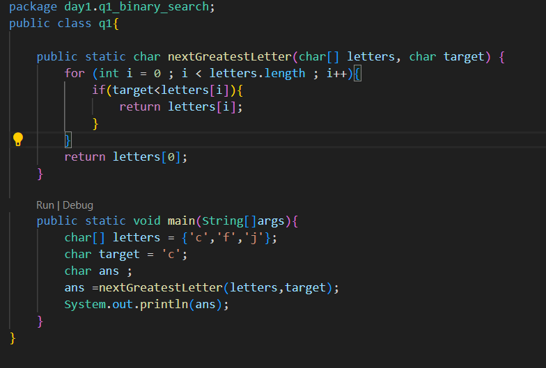

This is the problem
 

You are given an array of characters letters that is sorted in non-decreasing order, and a character target. There are at least two different characters in letters.

Return the smallest character in letters that is lexicographically greater than target. If such a character does not exist, return the first character in letters.

Solution:

<li>Parse array</li>
<li>If target> arr[i] --> i++</li>
<li>If target is not > arr[i] --> return arr[i]</li>
<li> If even at the end of parsing the array there is no character that fulfills the if condition --> return arr[0]</li>

In Java

